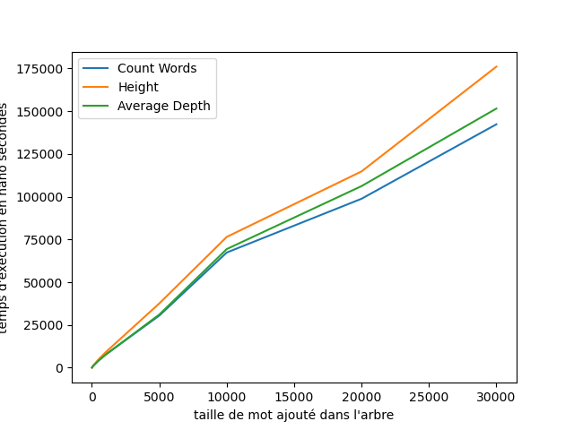

# Trie Hybride


```typescript
class HybridTrie {
  root: HybridTrieNode | null;
}

class HybridTrieNode {
  character: string;
  is_end_of_word: boolean;
  left: HybridTrieNode | null;
  right: HybridTrieNode | null;
  middle: HybridTrieNode | null;
}
```

# Recherche

- On compare le caractère courant du mot avec le caractère du noeud courant
- Si le caractère est plus petit, on va à gauche
- Si le caractère est plus grand, on va à droite
- Si le caractère est égal, on va au milieu et on passe au caractère suivant
- Si le mot est vide, on regarde si le noeud est une fin de mot

# Equilibrage

- Calcule du facteur d'équilibrage
  - la différence de hauteur entre le fils gauche et le fils droit
- Si le facteur d'équilibrage est supérieur à 1
  - Rotation droite
- Si le facteur d'équilibrage est inférieur à -1
  - Rotation gauche

# 


# 


# Patricia Trie

```typescript
class PatriciaTrie {
  root: PatriciaTrieNode;
}

class PatriciaTrieNode {
  label: string;
  is_end_of_word: boolean;
  children: Map<string, PatriciaTrieNode>;
  // Map Les clés sont le premier caractère du label
}
```

# Recherche

- On compare le label avec le mot à chercher
- Si le label n'est pas un préfixe du mot, on retourne faux
- Si le label est un préfixe du mot, on continue la recherche dans les enfants on retirant le préfixe
- Si le mot est vide, on regarde si le noeud est une fin de mot

# Fusion

- Vérification si la clé existe déjà dans `this.children`.

- Si elle n'existe pas, l'enfant est ajouté directement

- Si elle existe, on appelle récursivement merge sur les sous-arbres correspondants.

- En cas de conflit (préfixes communs, label différent), on :

  - Calcule la longueur du préfixe commun.

  - Réorganise les labels et les sous-arbres, ce qui implique de modifier ou de créer de nouveaux nœuds.

- On répète ces opérations pour chaque enfant du second Patricia-Trie

# 



# 

