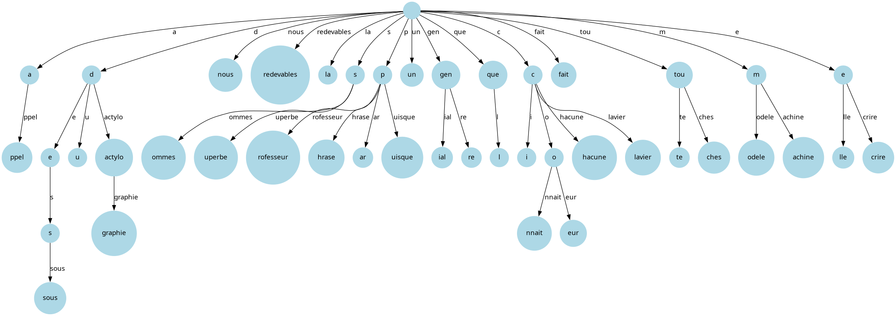

# 2. Patricia Trie


## Présentation


Le Patricia Trie est une structure de données qui détient les éléments suivant :

- un label qui est une chaine de texte
- un tableau de pointeur vers les fils

Le Patricia Trie est un arbre de recherche qui permet de stocker des mots. Chaque noeud de l'arbre est un label qui est une chaine de caractère. Les fils d'un noeud sont stockés dans un tableau de pointeur. Chaque fils est associé à un caractère de l'alphabet.

Le principe de base du Patricia Trie est de stocker les mots dans l'arbre en fonction de leur préfixe. Ainsi, les mots qui ont un préfixe commun sont stockés dans le même sous-arbre.


## Implémentation


Notre implémentation du Patricia Trie contient les éléments suivants :

```typescript
class PatriciaTrie {
  root: PatriciaTrieNode;
}

class PatriciaTrieNode {
  label: string;
  is_end_of_word: boolean;
  children: Map<string, PatriciaTrieNode>; // Map c'est une hashmap
}
```

Le Patricia Trie est implémenté en utilisant une classe `PatriciaTrie` qui contient un attribut `root` qui est un pointeur vers le noeud racine de l'arbre.

Les noeuds de l'arbre sont implémentés en utilisant une classe `PatriciaTrieNode`. Chaque noeud contient un label qui est une chaine de caractère, un attribut `is_end_of_word` qui indique si le noeud est la fin d'un mot, et un attribut `children` qui est une hashmap qui contient les fils du noeud.

Nous avons opté plutôt pour un boolean `is_end_of_word` pour indiquer la fin d'un mot, car cela permet de simplifier l'implémentation de certaines opérations et de ne pas se réduire à un ensemble de charactère. Dans notre cas notre code supporte tout les caractères UTF-8 car c'est le standard en Javascript.

De même, si nous étions dans un langage bas niveau, nous aurions pu utiliser un tableau de pointeur pour les enfants où la position représente un charactère unicode; Mais en Javascript, nous avons préféré utiliser une hashmap pour simplifier l'implémentation, les clés de cette hashmaps sont le premier charactère du label (Créer une case pour chaque caractère UTF-8 n'est pas envisageable). Les différentes opérations des hashmaps et des tableaux sont sensiblement les mêmes en terme de complexité (O(1) pour l'accès et l'insertion). De plus les Map en Javascript retienne la taille, ce qui simplifie l'implémentation de certaines opérations et permet de ne pas avoir à parcourir l'ensemble des enfants.





## Analyse


### ComptageMot, ComptageNil, Hauteur, ProfondeurMoyenne et ListeMots

Ces opérations procédent de la même manière, elles parcourent l'arbre en profondeur une fois en utilisant une récursion et receuille les informations dont elles ont besoin. 
Que ce soit dans le pire des cas ou dans le meilleur des cas, nous sommes obligés de parcourir tous les noeuds de l'arbre pour effectuer ces opérations. 
La complexité de ces opérations est en $O(n)$ où $n$ est le nombre de noeuds de l'arbre.

NB: Pour la méthode ComptageNil, au vu de notre implémentation les pointeurs nulles sont abstractisés par l'objet `Map` de Javascript, pour le bien de l'exercice nous considérons un `Map` vide comme un pointeur nul.

Nous remarquon effectivement que la complexité est en $O(n)$ dans nos tests.


### Recherche et Suppression


La supression est semblable à la recherche, car le gros du calcul est fait par la recherche du noeud à supprimer.

Il y a 2 variables qui influent sur la complexité de la recherche et de la suppression :

- $n$ : la longueur du mot recherché
- $m$ : Nombre moyen de caractères dans un label de nœud.

Pour chaque niveau de récursion, nous devons récupérer l'enfant dans `children` ce qui est en $O(1)$ en moyenne, et comparer le label du noeud avec le mot recherché ce qui est en $O(m)$ (dans le code, cela est représenté par la fonction `startsWith`). 

Le nombre maximal de niveaux de récursion est proportionnel à la longueur de la chaîne $n$, divisée par la longueur moyenne des labels $m$. Cela donne environ $n/m$ appels récursifs.

Ainsi, la complexité totale est : 

$$ O \left( \sum^{n/m}_{i=1} (1+m) \right) \approx O(n) $$

Dans nos benshmarks, les méthodes sont assez ébruitées, nous supposons qu'au vu du fait que les fonctions s'exécutent très rapidement (de l'ordre de la centaine de nanosecondes), les mesures sont sujettes à des erreurs de mesure et de bruit. Mais si une tendance devait être dégagée, elle aurait l'air logarithmique ?


### Prefixe


La méthode traverse plusieurs niveaux de l’arbre jusqu’à atteindre un nœud où `prefix` devient vide ou non trouvé. À chaque niveau :

- La recherche dans `children` est en $O(1)$ en moyenne

- La comparaison de label (avec `startsWith`) est en $O(m)$ (avec $m$ la longueur moyenne des labels)

La profondeur maximale de l'arbre est $n/m$ (avec $n$ la longueur du mot le plus long et $m$ la longueur moyenne des labels), ce qui nous donne alors en moyennne $n/m$ récursion, et ensuite la methode `ComptageMot` est appelée une fois.

La complexité de l'appel final `ComptageMot` dans le pire des cas est $O(n-k) = O(n)$ où $k$ est les noeuds traversés.

Donc, la complexité totale est :

$$ O \left( \sum^{n/m}_{i=1} (1+m) \right) + O(n) \approx O(n) $$

Dans nos benshmarks, nous remarquons bien la tendance linéaire de la méthode.


### Fusion


#### 1. Parcours des enfants


Pour chaque noeud du second Patricia-Trie (node), on effectue les opérations suivantes :

- Vérification si la clé existe déjà dans this.children. Cette opération est $O(1)$ grâce à la structure Map.

- Si elle n'existe pas, l'enfant est ajouté directement, ce qui est également $O(1)$.

- Si elle existe, on appelle récursivement merge sur les sous-arbres correspondants.


#### 2. Gestion des préfixes communs


En cas de conflit (préfixes communs), on :

- Calcule la longueur du préfixe commun. Cette opération est proportionnelle à la longueur du label, soit $O(m)$.

- Réorganise les labels et les sous-arbres, ce qui implique de modifier ou de créer de nouveaux nœuds. Ces opérations sont constantes par nœud, soit $O(1)$.


#### 3. Récursion


La fonction est appelée récursivement pour chaque enfant. Le nombre total d'appels récursifs est proportionnel au nombre total de noeuds $n_2$ dans le second Patricia-Trie.


#### 4. Conclusion


Chaque enfant dans node est traité en $O(m)$ dans le pire cas, en tenant compte de la vérification et du traitement des préfixes communs. La fonction est appelée récursivement pour tous les enfants, donc pour $n_2$ noeuds au total. On a donc :

$$ O \left( n_2 \times m \right) $$

Dans le pire cas où tous les labels ont des longueurs similaires, $m$ est une constante, et la complexité devient linéaire en fonction du nombre de noeuds dans le second Patricia-Trie :

$$ O(n_2) $$

Dans nos benshmarks, nous remarquons bien la tendance linéaire de la méthode.
