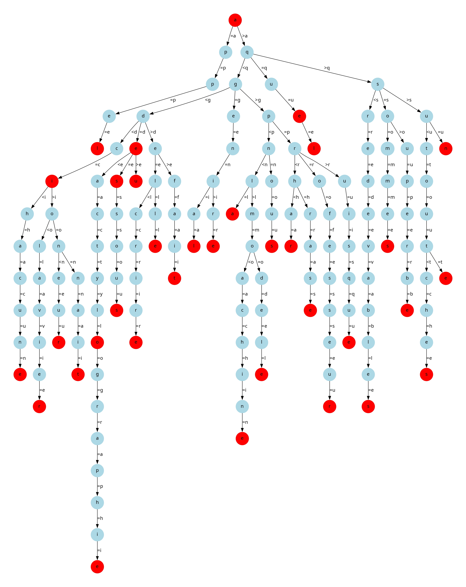

# 3. Hybrid trie


## Présentation


Le Hybrid trie est une structure de données qui détient les éléments suivant :

- un caractère
- un pointeur left
- un pointeur right
- un pointeur middle

Le Hybrid trie est un arbre de recherche qui permet de stocker des mots. Chaque noeud de l'arbre est un character. Le fils est stocké dans le pointeur middle. Les caractères plus petits que le noeud sont stockés dans le pointeur left et les caractères plus grands que le noeud sont stockés dans le pointeur right.

Le principe de base du Hybrid trie est de stocker les mots dans l'arbre en fonction de leur préfixe. Ainsi, les mots qui ont un préfixe commun sont stockés dans le même sous-arbre.


## Implémentation


Notre implémentation du Hybrid trie contient les éléments suivants :

```typescript
class HybridTrie {
  root: HybridTrieNode | null;
}

class HybridTrieNode {
  character: string;
  is_end_of_word: boolean;
  left: HybridTrieNode | null;
  right: HybridTrieNode | null;
  middle: HybridTrieNode | null;
}
```

Le Hybrid Trie est implémenté en utilisant une classe `HybridTrie` qui contient un attribut `root` qui est un pointeur vers le noeud racine de l'arbre.

Les noeuds de l'arbre sont implémentés en utilisant une classe `HybridTrieNode`. Chaque noeud contient un caractère, un attribut `is_end_of_word` qui indique si le noeud est la fin d'un mot, et trois pointeurs `left`, `right` et `middle` qui pointent respectivement vers les noeuds dont le caractère est plus petit, plus grand ou égal au caractère du noeud.

De même que pour le Patricia Trie, nous avons opté pour un boolean `is_end_of_word` pour indiquer la fin d'un mot, car cela permet de simplifier l'implémentation de certaines opérations et de ne pas se réduire à un ensemble de charactère. 




## Analyse


### ComptageMot, ComptageNil, Hauteur, ProfondeurMoyenne et ListeMots


Ces opérations procédent de la même manière, elles parcourent l'arbre en profondeur une fois en utilisant une récursion et receuille les informations dont elles ont besoin. 
Que ce soit dans le pire des cas ou dans le meilleur des cas, nous sommes obligés de parcourir tous les noeuds de l'arbre pour effectuer ces opérations.
La complexité de ces opérations est en $O(n)$ où $n$ est le nombre de noeuds de l'arbre.

Dans nos benshmarks, nous avons effectivement observé que la complexité est en $O(n)$.


### Recherche et Suppression


La supression est semblable à la recherche, car le gros du calcul est fait par la recherche du noeud à supprimer.

Pour chaque caractère du mot on peut soit rechercher à droite ou à gauche soit au milieu :

- Dans le cas gauche/droite (recherche d'un caractère), la structure de l'arbre est semblable à un arbre binaire de recherche, la complexité est en $O(h)$ où $h$ est la hauteur de l'arbre. La hauteur moyenne d'un arbre binaire de recherche est $h ~ log n$ où $n$ est le nombre de noeuds de l'arbre. La complexité de la recherche d'un caractère est donc en $O(log n)$.

- Dans le cas du milieu, la complexité est en $O(m)$ où $m$ est la longueur du mot.

Pour un mot de longueur $m$, la recherche nécessite $m$ recherches de caractères. La complexité de la recherche est donc:

$$ O(m \times log  n) $$

À noter que dans le pire des cas (un arbre dégénéré, où $h ~ n$), la complexité de la recherche est en $O(n)$ car il est en effet possible de parcourir tous les noeuds de l'arbre pour trouver le mot. (ex: trouver le mot "z" dans un arbre où on a inséré les mots "a", "b", "c", ..., "y", "z")

Dans nos benchmarks, la méthode de recherche est ébruitée, mais nous pouvons observer la complexité logaritmique.

Ceci dit pour la méthode de suppression, notre graphique pointe plutôt vers une complexité en $O(n)$. Nous ne saurons pas expliquer pourquoi la suppression est plus lente que la recherche, alors qu'une bonne partie de l'algorithme est commune aux deux méthodes.


### Prefixe


La fonction Prefixe est une combinaison de la methode de recherche et de la methode de comptage, vu qu'elle fonctionne en cherchant le prefixe et en comptant le nombre de mots qui ont ce prefixe. La complexité de cette fonction est donc en :

$$ O(m \times log  n) + O(n_{sousarbre}) $$

où $n_{sousarbre}$ est le nombre de noeuds du sous-arbre qui contient les mots qui ont le prefixe.

À noter qu'il y a plusieurs cas particuliers :

- Si le prefixe n'est pas dans l'arbre, la complexité est en $O(m \times {log} n)$ vu qu'il y a pas d'appel à la fonction `ComptageMot`.

- Cas où l'arbre est dégénéré, la complexité de la recherche est ein $O(n)$ donc la complexité de la fonction est en $O(n)$ car $n$ prédomine $n_{sousarbre}$.

- Cas grand sous arbre (peut arriver si le prefix est de petite taille), la complexité de la fonction est en $O(n_{sousarbre})$ car $n_{sousarbre}$ prédomine $m \times {log} n$.

Dans nos benchmarks, nous avons observé une complexité proche du $O(m \times log  n)$ mais pas assez claire pour être affirmatif.


### Equilibrage

Au début du fichier `src/HybridTrie/HybridTrieNode.ts` nous pouvons trouver constante `BALANCE` qui si elle est définie à `true` permet d'équilibrer l'arbre à chaque insertion. Cela permet de réduire la hauteur de l'arbre et donc de réduire la complexité des opérations de recherche, de suppression et de prefixe.

L'équilibrage est fait en utilisant la méthode `balance` qui est appellé pour chaque noeud où l'algorithme d'insertion est passée et elle procéde comme suit :

- On calcule le facteur d'équilibre du noeud courant (la différence de hauteur entre le sous-arbre gauche et le sous-arbre droit)
- Si le facteur d'équilibre est supérieur à 1, on fait une rotation droite
- Si le facteur d'équilibre est inférieur à -1, on fait une rotation gauche


La fonction `getBalanceFactor` a pour complexité $O(h)$ où $h$ est la hauteur du sous-arbre. En effet, elle fait appel à la fonction `height` qui a une complexité en $O(h)$.

À chaque appel de la méthode `balance` nous faisons : 

- Un appel à `getBalanceFactor` qui a une complexité en $O(h)$

- Si cela correspond à un cas de rotation, nous faison une rotation qui ont une complexité en $O(1)$


La complexité de l'équilibrage est donc dominée par la complexité de `getBalanceFactor` qui est en $O(h)$.

Sachant que notre algorithme d'équilibrage est appelé à noeud où passe l'insertion, la complexité de l'équilibrage est en $O(h^2)$ où $h$ est la hauteur de l'arbre.

À noter que notre méthode d'équilibrage peut être améliorée en stockant la hauteur de chaque noeud pour éviter de recalculer la hauteur à chaque appel de la méthode `height` (appelé par `getBalanceFactor`). Cela permettrait de réduire énormément le temps de calcul de l'équilibrage.

Dans nos benchmarks, nous avons observé que l'équilibrage permet de réduire la hauteur de l'arbre et donc de réduire la complexité des opérations de recherche, de suppression et de prefixe. Cependant pas de manière significative. En effet, un arbre Hybride par ajout de mots est proche d'un arbre équilibré, le cas des arbres dégénérés est rare,donc l'équilibrage n'apporte pas de grand changement.

Ceci dit, l'équilibrage ralenti remarquablement l'insertion, jusqu'à 1000 fois plus lent que sans équilibrage. 


